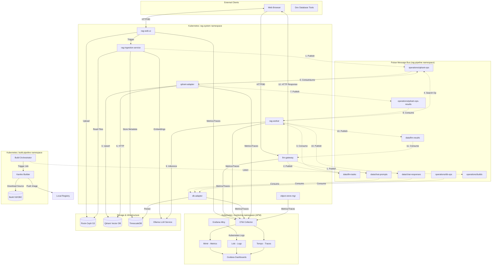
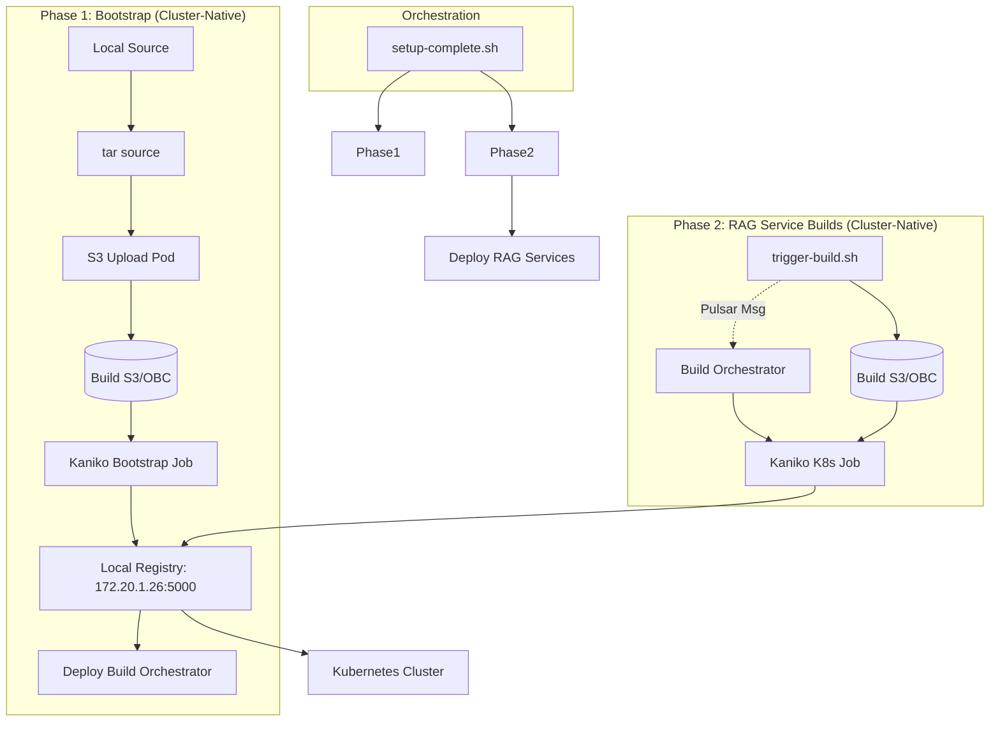

Based on the current implementation of the RAG stack (Iteration 5), here is a graphical representation of the components, the build process, and the asynchronous message interconnections via the Pulsar bus.

#### 1. Architecture & Message Interconnections (Mermaid Diagram)

#### 2. Component Descriptions

*   **`rag-web-ui`**: The front-end service providing pages for **Data Ingestion** and **Interactive Chat**. It triggers ingestion via REST and interacts with the `llm-gateway`.
*   **`llm-gateway`**: Acts as an OpenAI-compatible entry point. It publishes user prompts to the Pulsar bus and waits for results asynchronously.
*   **`rag-worker`**: The core processing unit. It consumes tasks, initiates async vector searches via the `qdrant-adapter`, generates context, and calls Ollama for the final LLM response.
*   **`qdrant-adapter`**: A dedicated service that centralizes all Qdrant database access. It listens to the `qdrant-ops` topic and publishes results to `qdrant-ops-results`, supporting horizontal scaling via Pulsar shared subscriptions.
*   **`db-adapter`**: A dedicated service for data persistence. It listens to all chat-related topics (`chat-prompts`, `chat-responses`) and administrative operations (`db-ops`) to keep TimescaleDB in sync.
*   **`object-store-mgr`**: Manages S3 operations and metadata for the RAG stack.
*   **`build-orchestrator`**: A cluster-native service that listens to build requests on Pulsar and orchestrates **Kaniko** jobs to build container images within the cluster.
*   **`common/telemetry`**: A shared Go library used by all services to initialize OpenTelemetry (OTLP) metrics and distributed tracing.
*   **Pulsar Bus**: Divided into `data` and `operations` namespaces to segregate application traffic from system management tasks.
*   **TimescaleDB**: Stores session metadata, chat history (split into `prompts` and `responses`), and ingestion tracking.
*   **APM Stack**: Includes Loki (logs), Mimir (metrics), Tempo (traces), and Grafana for visualization. Grafana Alloy collects Kubernetes logs, while the OpenTelemetry Collector receives application telemetry.

#### 3. Build & Deployment Flow

*   **Zero-Host Build Architecture**: The entire stack, including the `build-orchestrator` itself, is now built using cluster-native tools (Kaniko). The `hierophant` host performs only lightweight source packaging (`tar`) and orchestration (`kubectl`/`pulsar-client`).
*   **Kaniko & S3**: Source code is packaged and uploaded to a dedicated S3 bucket (OBC) in the `build-pipeline` namespace. Kaniko pods download these tarballs to build images, avoiding the need for a local Docker/Podman daemon.
*   **Orchestration**: The master script `setup-complete.sh` ensures that the build infrastructure is bootstrapped first, then triggers builds for all services, and finally deploys the RAG stack once images are verified in the registry.