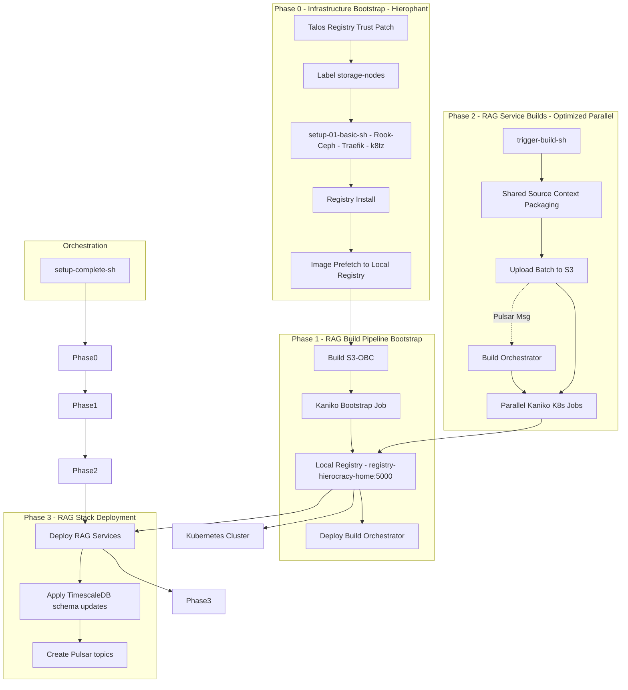

Based on the current implementation of the RAG stack (Iteration 6 planning + Iteration 5 runtime), here is a refreshed architecture representation of components, build flow, and asynchronous interconnections.

#### 1. Architecture & Message Interconnections - Mermaid Diagram -

> **Note**: A standalone, editable version of this diagram is available at [diagrams/architecture.mmd](./diagrams/architecture.mmd).

```mermaid
graph TD
    subgraph "External Clients"
        Browser[Web Browser]
        Explorer[RAG Explorer - Desktop]
        DevDB[Dev Database Tools]
    end

    subgraph "Kubernetes: rag-system namespace: TLS-SSL"
        UI[rag-web-ui]
        Flutter[rag-explorer]
        Gateway[llm-gateway]
        Worker[rag-worker]
        DBAdapter[db-adapter]
        Aggregator[prompt-aggregator]
        Ingestor[rag-ingestion-service]
        QAdapter[qdrant-adapter]
        OSMgr[object-store-mgr]
        Qdrant[Qdrant Vector DB]
    end

    subgraph "Kubernetes: monitoring namespace: APM"
        Alloy[Grafana Alloy - DaemonSet]
        Loki[Loki - Gateway TLS]
        Mimir[Mimir - Gateway TLS]
        Tempo[Tempo - HTTPS Push]
        Grafana[Grafana Dashboards]
    end

    subgraph "Kubernetes: build-pipeline namespace"
        Orch[Build Orchestrator]
        Kaniko[Kaniko Builder]
        BuildS3[Build S3-OBC]
    end

    subgraph "Kubernetes: llms-ollama namespace"
        Ollama[Ollama - Planner]
        OllamaCode[Ollama - Executor]
    end

    subgraph "Pulsar Message Bus: rag-pipeline: TLS-SSL"
        direction LR
        Ingress[stage/ingress]
        Plan[stage/plan]
        Search[stage/search]
        Exec[stage/exec]
        Results[stage/results]
        Completion[stage/completion]
        Prompts[data/chat-prompts]
        Sessions[sessions/UUID-topic]
        Ops[operations/db-ops]
        QOps[operations/qdrant-ops]
        QRes[operations/qdrant-ops-results]
        BuildTopic[operations/builds]
    end

    subgraph "Storage & Infrastructure: TLS-SSL"
        S3[Rook-Ceph S3]
        TDB[TimescaleDB]
        Reg[Local Registry]
    end

    %% Interaction Flows: HTTPS
    Browser <-->|HTTPS/443| UI
    Explorer <-->|Websocket/HTTPS| Gateway

    %% Registry Flow
    UI & Flutter & Gateway & Worker & DBAdapter & Ingestor & QAdapter & OSMgr -.->|Pull TLS| Reg
    S3 & Qdrant & TDB & Ollama & OllamaCode -.->|Pull TLS| Reg

    %% Ingestion Flow
    Flutter -->|Upload: S3 API| S3
    Flutter -->|Trigger: HTTPS| Ingestor
    Ingestor -->|Store Metadata: TLS| TDB
    Ingestor -.->|1- Publish: Pulsar+SSL| QOps
    QAdapter -.->|2- Consume: Pulsar+SSL| QOps
    QAdapter -->|3- Upsert: GRPC+TLS| Qdrant
    Ingestor -->|Read Files: S3 API| S3
    Ingestor -->|Embeddings: HTTP| Ollama

    %% Chat Flow: Isolated Session Streaming
    Gateway -.->|1- Publish| Prompts
    Gateway -.->|2- Publish| Ingress

    Ingress -.->|3- Consume| Worker
    Worker -.->|4- Search Op| QOps
    QOps -.->|5- Consume| QAdapter
    QAdapter -->|6- GRPC+TLS| Qdrant
    QAdapter -.->|7- Publish| QRes
    QRes -.->|8- Consume| Worker

    %% Worker transitions
    Worker -.->|9- Publish| Plan
    Plan -.->|10- Consume| Worker
    Worker -.->|11- Publish| Search
    Search -.->|12- Consume| Worker
    Worker -.->|13- Publish| Exec
    Exec -.->|14- Consume| Worker

    Worker -->|15- Inference| Ollama
    Worker -->|16- Inference| OllamaCode
    Worker -.->|17- Stream Chunks| Sessions
    Worker -.->|18- Completion Signal| Completion

    Sessions -.->|19- Read Stream| Gateway
    Completion -.->|20- Trigger| Aggregator
    Aggregator -.->|21- Read Session Data| Sessions
    Aggregator -.->|22- Publish| Results
    Results -.->|23- Consume| DBAdapter
    Gateway -->|24- Final Response| Explorer

    %% Persistent Flow: DB Adapter
    Prompts -.->|Consume| DBAdapter
    Results -.->|Consume| DBAdapter
    Ops -.->|Consume| DBAdapter
    DBAdapter -->|Persist: TLS| TDB

    %% Observability Flow: OTLP & Logs over HTTPS
    UI & Gateway & Worker & DBAdapter & QAdapter & OSMgr -->|OTLP/HTTPS| Alloy
    Alloy -->|Metrics: HTTPS| Mimir
    Alloy -->|Logs: HTTPS| Loki
    Alloy -->|Traces: HTTPS/4318| Tempo
    Tempo -->|Generated Metrics| Mimir
    Mimir & Loki & Tempo --> Grafana

    %% Build Pipeline Flow
    Orch -.->|Listen| BuildTopic
    Orch -->|Trigger Job| Kaniko
    Kaniko -->|Download Source| BuildS3
    Kaniko -->|Push Image: TLS| Reg
```

#### 2. Component Descriptions

- `rag-web-ui`: Legacy front-end for data ingestion and interactive chat; secured via Traefik HTTPS.
- `rag-explorer`: Advanced Flutter-based management UI for the RAG pipeline. Supports granular ingestion control, metadata inspection, and real-time session monitoring.
- `llm-gateway`: OpenAI-compatible entry point; manages session lifecycle and asynchronous task delegation. Now supports isolated session topics for streaming.
- `rag-worker`: Core orchestration engine with modular LLM support (Llama/Granite); integrates multi-stage RAG logic (ingress/plan/search/exec).
- `qdrant-adapter`: Centralized vector DB adapter ensuring consistent tag-filtered search and upsert logic.
- `db-adapter`: Async persistence layer for audit logs, session state, and chat history.
- `prompt-aggregator`: High-performance aggregation service that assembles streaming chunks from session-specific Pulsar topics into final results.
- `rag-ingestion-service`: Persistent Python service for multi-source data ingestion and embedding generation.
- `common/telemetry`: Shared OTLP package for distributed tracing and Prometheus metrics; services export to local `Alloy` instances.
- `Grafana Dashboards`: Targeted observability including the "RAG Stack Operational Overview" dashboard for tracking throughput, latency, and GPU utilization.
- `TLS/Security`: end-to-end encryption using `cert-manager` and internal Root CA; all inter-service traffic uses HTTPS, GRPC+TLS, or Pulsar+SSL. Monitoring (Loki/Mimir/Tempo) uses NGINX-based TLS gateways.
- `k8tz`: Cluster-wide timezone injection (`Europe/London`) for consistent log/metric timestamps.
- `metrics-generator`: Tempo module for generating RED metrics from traces, remote-writing to Mimir.

#### 3. Contextual Memory Model - Miras/Titans-Inspired -

- **Short-Term Memory**: Recency-weighted session context for immediate turn-to-turn coherence.
- **Long-Term Memory**: Semantic recall of past sessions and ingested data using vector similarity.
- **Persistent Memory**: Durable storage of user profiles, specialized constraints, and verified facts.
- **Salience Scoring**: Context-aware ranking that prioritizes information based on novelty and query relevance. (Note: implementation in progress).
- **Token Budgeting**: Strict management of prompt context windows using prioritized "Memory Packs".

#### 3. Build & Deployment Flow - Hierophant Bootstrapped -

> **Note**: A standalone, editable version of this diagram is available at [diagrams/build-flow.mmd](./diagrams/build-flow.mmd).

- **Zero-host build architecture**: Source packaging + in-cluster Kaniko builds.
- **Shared Context Optimization**: All services in a batch share a single source tarball, reducing S3 IO and upload time.
- **Parallel Orchestration**: Concurrent Kaniko jobs significantly reduce end-to-end build latency for the full stack.
- **Go Layer Caching**: Dockerfiles optimized to cache dependency downloads separately from source compilation.
- **Registry Isolation**: All components pull from `registry.hierocracy.home:5000` after prefetch.
- **Resumable Setup**: `setup-complete.sh` uses a journal to track progress across these phases.

#### 4. Topology & Node Affinity
- **storage-node**: Nodes labeled `role=storage-node` (e.g., worker-0..3) host Ceph OSDs, Pulsar brokers, and APM stack.
- **inference-node**: GPU-enabled nodes reserved for `ollama` and GPU-intensive tasks.
- **control-plane**: Talos control plane nodes managing the API and local registry.
