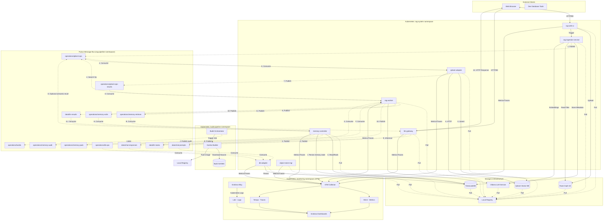
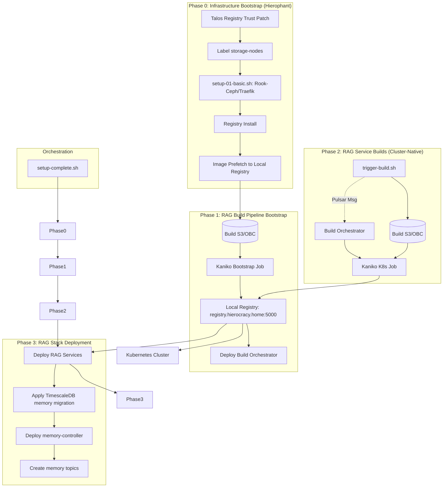

Based on the current implementation of the RAG stack (Iteration 6 planning + Iteration 5 runtime), here is a refreshed architecture representation of components, build flow, and asynchronous interconnections.

#### 1. Architecture & Message Interconnections (Mermaid Diagram)

#### 2. Component Descriptions

- `rag-web-ui`: Front-end for data ingestion and interactive chat.
- `llm-gateway`: OpenAI-compatible entry point; publishes prompts/tasks and returns final async response.
- `rag-worker`: Core orchestration engine for retrieval + generation, now requesting/synthesizing memory packs.
- `memory-controller`: New Iteration 6 service for memory write/retrieve orchestration, ranking, retention updates, and audit events.
- `qdrant-adapter`: Centralized vector DB adapter consuming `qdrant-ops` and returning `qdrant-ops-results`.
- `db-adapter`: Persists prompts/responses and db operations into TimescaleDB.
- `object-store-mgr`: S3 metadata and object lifecycle manager.
- `build-orchestrator`: Cluster-native Kaniko build dispatcher.
- `common/telemetry`: Shared OTLP/tracing initialization package used by Go services.
- Pulsar bus: Segregated `data` and `operations` topics, extended with memory topics.
- TimescaleDB: Session/chat state plus Iteration 6 memory model (`memory_items`, `memory_links`, `memory_events`).
- APM stack: Loki, Mimir, Tempo, Grafana, and Alloy.

#### 3. Build & Deployment Flow (Hierophant Bootstrapped)

- **Zero-host build architecture**: Source packaging + in-cluster Kaniko builds.
- **Registry Isolation**: All components (Infra + RAG) pull from `registry.hierocracy.home:5000` after prefetch.
- **Resumable Setup**: `setup-complete.sh` uses a journal to track progress across these phases.

#### 4. Topology & Node Affinity
- **storage-node**: Nodes labeled `role=storage-node` (e.g., worker-0..3) host Ceph OSDs, Pulsar brokers, and APM stack.
- **inference-node**: GPU-enabled nodes reserved for `ollama` and GPU-intensive tasks.
- **control-plane**: Talos control plane nodes managing the API and local registry.
