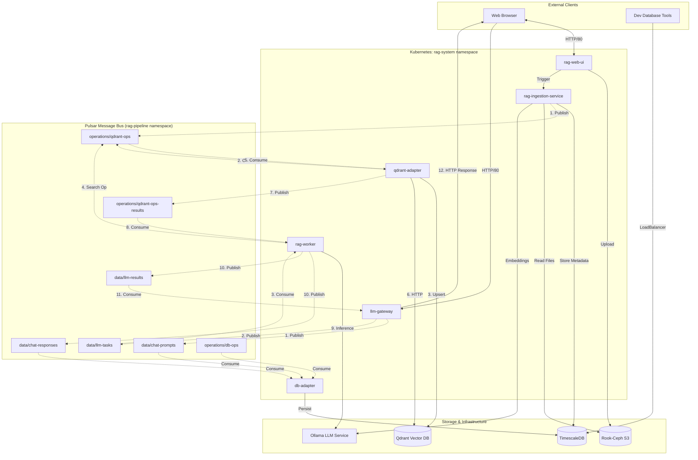
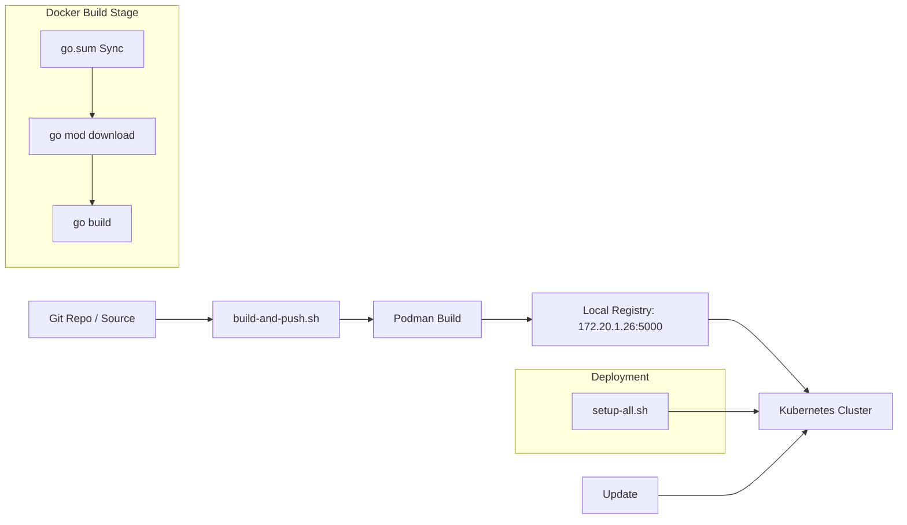

Based on the current implementation of the RAG stack (Iteration 4), here is a graphical representation of the components, the build process, and the asynchronous message interconnections via the Pulsar bus.

#### 1. Architecture & Message Interconnections (Mermaid Diagram)

#### 2. Component Descriptions

*   **`rag-web-ui`**: The front-end service providing pages for **Data Ingestion** and **Interactive Chat**. It triggers ingestion via REST and interacts with the `llm-gateway`.
*   **`llm-gateway`**: Acts as an OpenAI-compatible entry point. It publishes user prompts to the Pulsar bus and waits for results asynchronously.
*   **`rag-worker`**: The core processing unit. It consumes tasks, initiates async vector searches via the `qdrant-adapter`, generates context, and calls Ollama for the final LLM response.
*   **`qdrant-adapter`**: A dedicated service that centralizes all Qdrant database access. It listens to the `qdrant-ops` topic and publishes results to `qdrant-ops-results`, supporting horizontal scaling via Pulsar shared subscriptions.
*   **`db-adapter`**: A dedicated service for data persistence. It listens to all chat-related topics (`chat-prompts`, `chat-responses`) and administrative operations (`db-ops`) to keep TimescaleDB in sync.
*   **Pulsar Bus**: Divided into `data` and `operations` namespaces to segregate application traffic from system management tasks.
*   **TimescaleDB**: Stores session metadata, chat history (split into `prompts` and `responses`), and ingestion tracking.

#### 3. Build & Deployment Flow

*   **Continuous Integration**: The `build-and-push.sh` script runs on the `hierophant` host, using Podman to create "thick" images and OCI artifacts for Ollama models.
*   **Registry**: Images are stored in a local, insecure registry reachable by all cluster nodes.
*   **Deployment**: Automated scripts (`setup-all.sh`) handle the creation of Namespaces, ConfigMaps (including source-code mounting for debugging), Secrets, and the rollouts of the microservices.