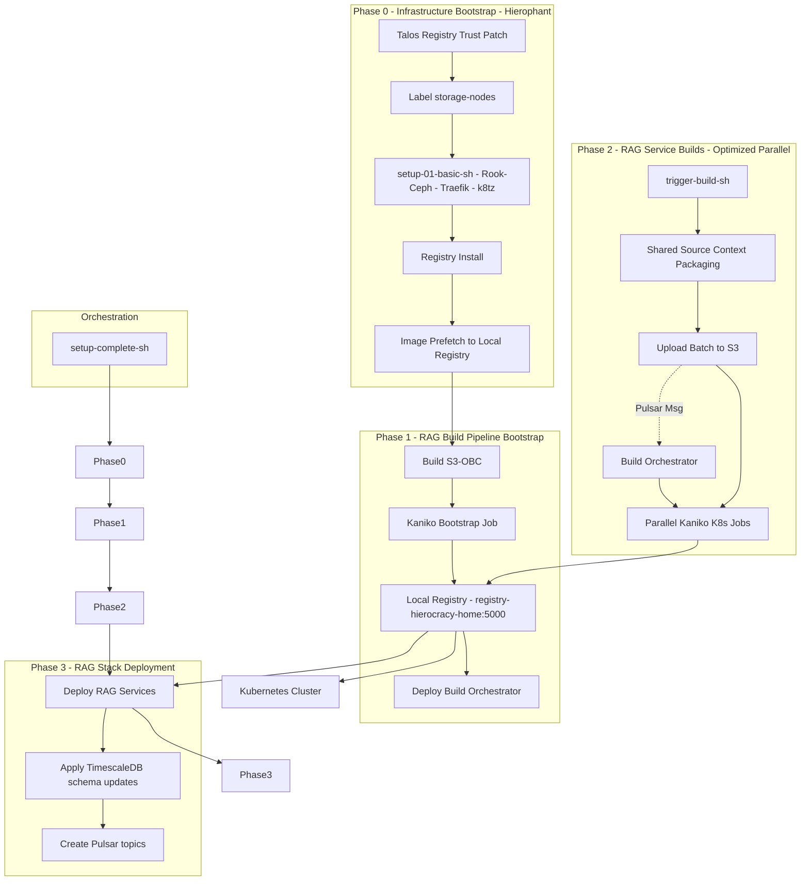

Based on the current implementation of the RAG stack (Iteration 9), here is a refreshed architecture representation of components, build flow, and asynchronous interconnections (v3.1.x).

#### 1. Architecture & Message Interconnections - Mermaid Diagram -

> **Note**: A standalone, editable version of this diagram is available at [diagrams/architecture.mmd](./diagrams/architecture.mmd).

```mermaid
graph TD
    subgraph "External Clients"
        Browser[Web Browser]
        Explorer[RAG Explorer - Desktop]
        DevDB[Dev Database Tools]
    end

    subgraph "Kubernetes: rag-system namespace: TLS-SSL"
        Flutter[rag-explorer]
        Admin[rag-admin-api]
        Gateway[llm-gateway]
        Worker[rag-worker]
        DBAdapter[db-adapter]
        Memory[memory-controller]
        Aggregator[prompt-aggregator]
        Ingestor[rag-ingestion-service]
        QAdapter[qdrant-adapter]
        OSMgr[object-store-mgr]
        Qdrant[Qdrant Vector DB]
    end

    subgraph "Kubernetes: monitoring namespace: APM"
        Alloy[Grafana Alloy - DaemonSet]
        Loki[Loki - Gateway TLS]
        Mimir[Mimir - Gateway TLS]
        Tempo[Tempo - HTTPS Push]
        Grafana[Grafana Dashboards]
    end

    subgraph "Kubernetes: build-pipeline namespace"
        Orch[Build Orchestrator]
        Kaniko[Kaniko Builder]
        BuildS3[Build S3-OBC]
    end

    subgraph "Kubernetes: llms-ollama namespace"
        Ollama[Ollama - Planner]
        OllamaCode[Ollama - Executor]
    end

    subgraph "Pulsar Message Bus: rag-pipeline: TLS-SSL"
        direction LR
        Ingress[stage/ingress]
        Plan[stage/plan]
        Search[stage/search]
        Exec[stage/exec]
        Results[stage/results]
        Completion[stage/completion]
        Prompts[data/chat-prompts]
        Sessions[sessions/UUID-topic]
        Ops[operations/db-ops]
        QOps[operations/qdrant-ops]
        QRes[operations/qdrant-ops-results]
        BuildTopic[operations/builds]
        MemWrite[rag/memory/write]
        MemRefresh[rag/memory/refresh]
    end

    subgraph "Storage & Infrastructure: TLS-SSL"
        S3[Rook-Ceph S3]
        TDB[TimescaleDB]
        Reg[Local Registry]
    end

    %% Interaction Flows: HTTPS
    Explorer <-->|HTTPS/443| Admin
    Admin <-->|Proxy| Gateway
    Admin <-->|Proxy| Ingestor
    Admin <-->|Proxy| DBAdapter
    Admin <-->|Proxy| Memory
    Admin <-->|Proxy| QAdapter
    Admin <-->|Proxy| OSMgr
    Gateway <-->|WS/HTTPS| Explorer

    %% Performance Optimization: Direct HTTP Search
    Worker -->|HTTPS/8082 - Search| QAdapter

    %% Registry Flow
    Flutter & Gateway & Worker & DBAdapter & Ingestor & QAdapter & OSMgr -.->|Pull TLS| Reg
    S3 & Qdrant & TDB & Ollama & OllamaCode -.->|Pull TLS| Reg

    %% Ingestion Flow
    Flutter -->|Upload: S3 API| S3
    Flutter -->|Trigger: HTTPS| Ingestor
    Ingestor -->|Store Metadata: TLS| TDB
    Ingestor -.->|1- Publish: Pulsar+SSL| QOps
    QAdapter -.->|2- Consume: Pulsar+SSL| QOps
    QAdapter -->|3- Upsert: GRPC+TLS| Qdrant
    Ingestor -->|Read Files: S3 API| S3
    Ingestor -->|Embeddings: HTTP| Ollama

    %% Chat Flow: Isolated Session Streaming
    Gateway -.->|1- Publish| Prompts
    Gateway -.->|2- Publish| Ingress

    Ingress -.->|3- Consume| Worker
    Worker -->|4- Search: HTTPS| QAdapter
    QAdapter -->|5- GRPC+TLS| Qdrant
    QAdapter -->|6- Search Results: HTTPS| Worker

    %% Worker transitions
    Worker -.->|7- Publish| Plan
    Plan -.->|8- Consume| Worker
    Worker -.->|9- Publish| Search
    Search -.->|10- Consume| Worker
    Worker -.->|11- Publish| Exec
    Exec -.->|12- Consume| Worker

    Worker -->|13- Inference| Ollama
    Worker -->|14- Inference| OllamaCode
    Worker -.->|15- Stream Chunks| Sessions
    Worker -.->|16- Completion Signal| Completion

    %% Memory Flow
    Worker -.->|17- Request Memory| MemRefresh
    Worker -.->|18- Submit Memory| MemWrite
    MemRefresh -.->|19- Consume| Memory
    MemWrite -.->|20- Consume| Memory
    MemWrite -.->|21- Consume| DBAdapter
    Memory -.->|22- Deliver MemoryPack| Sessions

    Sessions -.->|23- Read Stream| Gateway
    Completion -.->|24- Trigger| Aggregator
    Aggregator -.->|25- Read Session Data| Sessions
    Aggregator -.->|26- Publish| Results
    Results -.->|27- Consume| DBAdapter
    Gateway -->|28- Final Response| Explorer

    %% Persistent Flow: DB Adapter
    Prompts -.->|Consume| DBAdapter
    Results -.->|Consume| DBAdapter
    Ops -.->|Consume| DBAdapter
    DBAdapter -->|Persist: TLS| TDB

    %% Observability Flow: OTLP & Logs over HTTPS
    Gateway & Worker & DBAdapter & QAdapter & OSMgr -->|OTLP/HTTPS| Alloy
    Alloy -->|Metrics: HTTPS| Mimir
    Alloy -->|Logs: HTTPS| Loki
    Alloy -->|Traces: HTTPS/4318| Tempo
    Tempo -->|Generated Metrics| Mimir
    Mimir & Loki & Tempo --> Grafana

    %% Build Pipeline Flow
    Orch -.->|Listen| BuildTopic
    Orch -->|Trigger Job| Kaniko
    Kaniko -->|Download Source| BuildS3
    Kaniko -->|Push Image: TLS| Reg
```

#### 2. Component Descriptions

- `rag-explorer`: Advanced Flutter-based management UI for the RAG pipeline. Supports granular ingestion control, metadata inspection, and real-time session monitoring.
- `rag-admin-api`: Management portal proxy and health aggregator; provides a unified API for `rag-explorer`. Now enforces API Key authentication for administration.
- `llm-gateway`: OpenAI-compatible entry point; manages session lifecycle and asynchronous task delegation. Supports isolated session topics and strict CORS for WebSocket security.
- `rag-worker`: Core orchestration engine. Now uses high-performance direct HTTP calls to `qdrant-adapter` for vector searches, eliminating sync-over-async latency.
- `qdrant-adapter`: Centralized vector DB adapter. Dual-mode support: Asynchronous Pulsar for background ingestion and High-Speed HTTP for real-time searches.
- `db-adapter`: Async persistence layer using Ent ORM. Standardized for TimescaleDB operations.
- `memory-controller`: Manages structured memory items, session-based graph links, and behavioral rules. Handles salience scoring, retention/decay, and MemoryPack assembly.
- `prompt-aggregator`: High-performance aggregation service that assembles streaming chunks using efficient blocking reader calls.
- `rag-ingestion-service`: Persistent Python service for multi-source data ingestion and embedding generation.
- `common/telemetry`: Shared OTLP package for distributed tracing and Prometheus metrics; all services expose `/metrics` for pull-based scraping and export traces to local `Alloy` instances.
- `TLS/Security`: end-to-end encryption using `cert-manager` and internal Root CA; all inter-service traffic uses HTTPS, GRPC+TLS, or Pulsar+SSL. Restricted RBAC via dedicated `rag-service-sa` ServiceAccount.
- `k8tz`: Cluster-wide timezone injection (`Europe/London`) for consistent log/metric timestamps.
- `metrics-generator`: Tempo module for generating RED metrics from traces, remote-writing to Mimir.

#### 3. Contextual Memory Model - Miras/Titans-Inspired -

- **Short-Term Memory**: Recency-weighted session context for immediate turn-to-turn coherence.
- **Long-Term Memory**: Semantic recall of past sessions and ingested data using vector similarity.
- **Persistent Memory**: Durable storage of user profiles, specialized constraints, and verified facts.
- **Salience Scoring**: Context-aware ranking that prioritizes information based on novelty and query relevance. (Note: implementation in progress).
- **Token Budgeting**: Strict management of prompt context windows using prioritized "Memory Packs".

#### 3. Build & Deployment Flow - Hierophant Bootstrapped -

> **Note**: A standalone, editable version of this diagram is available at [diagrams/build-flow.mmd](./diagrams/build-flow.mmd).

```mermaid
flowchart TD
    subgraph "Phase 0 - Infrastructure Bootstrap - Hierophant"
        Talos[Talos Registry Trust Patch] --> Labels[Label storage-nodes]
        Labels --> Basic[setup-01-basic-sh - Rook-Ceph - Traefik - k8tz]
        Basic --> Reg[Registry Install]
        Reg --> Prefetch[Image Prefetch to Local Registry]
    end

    subgraph "Phase 1 - RAG Build Pipeline Bootstrap"
        Prefetch --> S3_1[Build S3-OBC]
        S3_1 --> BootstrapJob[Kaniko Bootstrap Job]
        BootstrapJob --> RegistryNode[Local Registry - registry-hierocracy-home:5000]
        RegistryNode --> OrchDeploy[Deploy Build Orchestrator]
    end

    subgraph "Phase 2 - RAG Service Builds - Optimized Parallel"
        Trigger[trigger-build-sh] --> Package[Shared Source Context Packaging]
        Package --> S3_2[Upload Batch to S3]
        S3_2 -.->|Pulsar Msg| Orch[Build Orchestrator]
        Orch --> Kaniko[Parallel Kaniko K8s Jobs]
        S3_2 --> Kaniko
        Kaniko --> RegistryNode
    end

    subgraph "Phase 3 - RAG Stack Deployment"
        RegistryNode --> Deploy[Deploy RAG Services]
        Deploy --> Migrate[Apply TimescaleDB schema updates]
        Migrate --> TopicInit[Create Pulsar topics]
    end

    RegistryNode --> K8s[Kubernetes Cluster]

    subgraph "Orchestration"
        Setup[setup-complete-sh]
    end

    Setup --> Phase0
    Phase0 --> Phase1
    Phase1 --> Phase2
    Phase2 --> Deploy
    Deploy --> Phase3
```

- **Zero-host build architecture**: Source packaging + in-cluster Kaniko builds.
- **Shared Context Optimization**: All services in a batch share a single source tarball, reducing S3 IO and upload time.
- **Parallel Orchestration**: Concurrent Kaniko jobs significantly reduce end-to-end build latency for the full stack.
- **Go Layer Caching**: Dockerfiles optimized to cache dependency downloads separately from source compilation.
- **Registry Isolation**: All components pull from `registry.hierocracy.home:5000` after prefetch.
- **Resumable Setup**: `setup-complete.sh` uses a journal to track progress across these phases.

#### 4. Topology & Node Affinity
- **storage-node**: Nodes labeled `role=storage-node` (e.g., worker-0..3) host Ceph OSDs, Pulsar brokers, and APM stack.
- **inference-node**: GPU-enabled nodes reserved for `ollama` and GPU-intensive tasks.
- **control-plane**: Talos control plane nodes managing the API and local registry.
